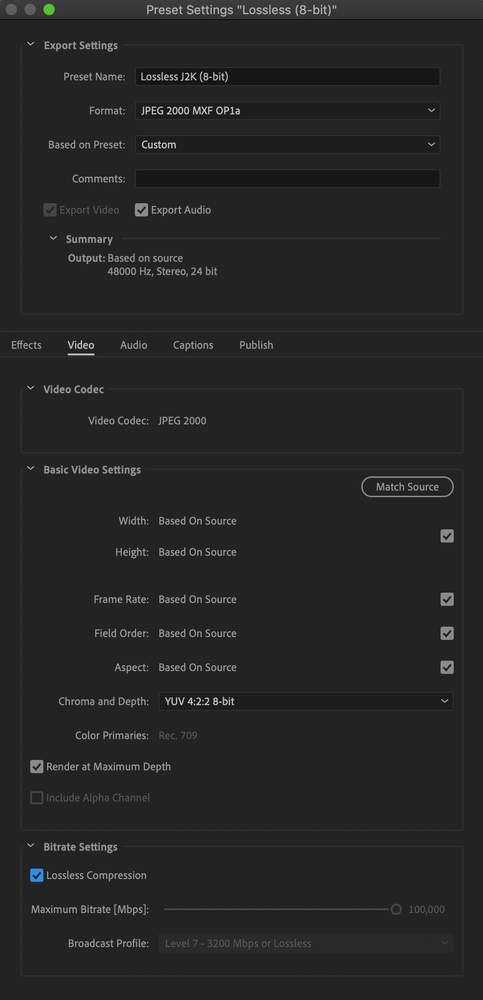
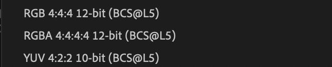
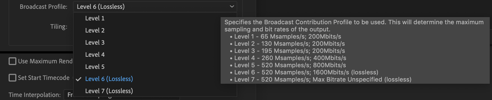
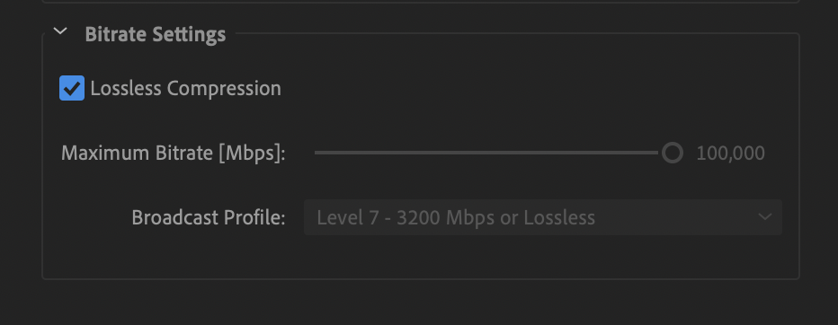
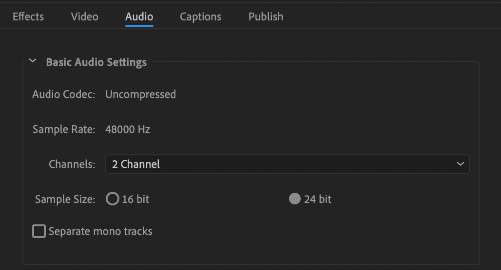
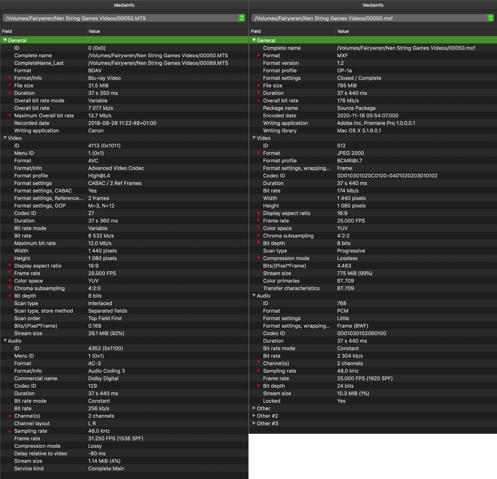

# Video Transcoding and Rewrapping Workflows for PARADISEC Archive

*[PARADISEC](https://paradisec.org) adheres to the current best-practice standards for video archiving as set by the International Association of Sound and Audiovisual Archives [(IASA)](https://www.iasa-web.org/).*

## Video Formats
PARADISEC accepts video content from our depositors that are analogue and need to be digitised as well as videos that are born-digital and need further transcoding or rewrapping. All analogue video digitising is sent to a commercial service provider for processing ([DAMSmart!](https://www.damsmart.com.au/)) We do all born-digital video processing in-house.

* **Analogue tape and film** we have received for archiving include: VHS, VHS-C, Betamax, U-MATIC, MiniDV, Super8

* **Digital file formats** we accept are the following: .MP4, .MPEG, .MPEG1, .MP2, .MPG, .M4V, .OGG, .MTS, .AVCHD, .AVI, .MOV, .QT, .DV, .WEBM, .WMV

We create two digital copies for each video we receive:

* .MXF (lossless JPEG2000) as an archival file
* .MP4 (H.264) as an access file

Below I outline PARADISEC's workflow for creating the two digital copies that come from a _born-digital_ source and go into our archive.

## MXF
**_Creating lossless JPEG2000 .MXF videos with Adobe Media Encoder (CC 2018 or later)_**

### Define Encoding Settings - Making an Encoding Preset
The first thing we need to do is select the settings that we can use each time we want to create a lossless J2K .MXF video. To do this, we need to create an Encoding Preset. Go to the top Media Encoder CC menu to “Presets” and then select “Create Encoding Preset”. A new Preset window will open up. Look at the image below to see the settings you should choose. Each will be explained below.

  

### Preset name and format
First you should give the preset a meaningful name, I have chosen **Lossless J2k (8-bit)**. The main reason for this particular name is to differentiate this preset from others you might use for different workflows (I will discus why I add the distinction **8-bit** below).

For the format, select **JPEG 2000 MXF OP1a**. Once you select this format, you are then offered these choices for the *Based on Preset* field:

  

You can leave the new default of **RGBA 4:4:4:4 12-bit (BCs@L5)**. This value will change once we make further refinements in our settings.

Leave the remaining settings in this section as their defaults (*Comments* field left blank, *Export Video* and *Export Audio* boxes ticked).

### Video settings
Edit only settings in the Video and Audio tabs. Settings in the other tabs (Effects, Captions, Publish) should be left untouched.

Because we selected the **JPEG 2000 MXF OP1a** format above, the video codec will automatically be set to **JPEG 2000** in this section. The basic video settings options will have changed to those appropriate for this format.

Make certain **Match Source** is selected, this will automatically tick all the boxes below (if they are not already), retaining the same settings as those of the original file for the following fields *Width*, *Height*, *Frame Rate*, *Field Order*, and *Aspect [ratio]*.

*Chroma* should be set to **YUV 4:2:2** with a *depth* of **8-bit**. In the rare case your original video has a colour depth of 10-bit, select the **10-bit** option. To determine the bit depth of a video, use [MediaInfo](https://mediaarea.net/en/MediaInfo) (more on MediaInfo [here](https://github.com/paradisec-archive/video_processing/blob/main/index.md#using-mediainfo-to-check-your-output-file-metadata)); the file’s bit depth is listed in the MediaInfo metadata output report.

> **Note:** If you are using CC2018: Set the Broadcast Profile to Level 6 (Lossless). This determines the maximum sampling and bit rates for the output file. You can see all the drop down choices offered below:

  

> **Note:** If you are using CC2020: You need only tick the box for *Lossless Compression*; The *Maximum Bitrate* and *Broadcast Profile* automatically get set to **100,000 Mbps** and **Level 7 - 3200Mbps or Lossless**, respectively

  

### Audio settings
There are not many adjustments that need to be made to the audio settings (see image below). The *Audio Codec* will already be set to **Uncompressed** with a *Sample Rate* of **48,000 Hz**. due to the choice of the video format of **JPEG 2000 MXF OP1a**.

  

Make certain the *Channels* field is set to **2**. If you are given a video that has been recorded with surround sound, there could be as many as 6 channels. Our standard is to have 2 channel stereo audio output for our .MXF files. 6 channel video files have caused problems for editing/playback in programs such as Adobe Premiere, etc. Then Set the *Sample Size* to **24 bit**.

### The remaining settings
The remaining settings located underneath the tab area should all be left with the default settings (see image below). This means that the following boxes should all be left unticked: *Use Maximum Render Quality*, *Use Previews*, *Set Start Timecode*, and *Render Alpha Channel Only*.

  

Leave the *Time Interpolation* set to **Frame Sampling**. This settings handles motion smoothing if you change the output file’s frames per second.

### Using MediaInfo to check your output file metadata

MediaInfo is the best method to access all of the file specifications you need in order to understand the structure of your media files. You should know the underlying specifications of your original file before you do any transcoding. This ensures that you are able to set your output settings to match the relevant specs of the original. Below is a side-by-side comparison of the MediaInfo outputs, with added red asterisks to highlight some of the specs to be aware of:

  

I have pulled out some of those specs for comparison in the table below. You will be creating a video that has an increased **_file size_** from the original; this is because the **_bitrate_** will have increased substantially due to the transcoding process for lossless .MXF. The **_durations_** need to be similar (within +/- 500ms).  Unless you clear any changes in specifications with the depositor first, you will need to keep the following specs the same: **_aspect ratio_**, **_frame rate_**, **_color space_**, and **_bit depth_**.  The **_audio channels_** may change from the original; an original video with six audio channels (surround sound) is problematic in Adobe. If the depositor requires the six channels to remain, this workflow will not handle it. Another one will need to be configured. 

Finally, the **_compression mode_** for the .MXF **MUST** indicate it is **_lossless_**. If it is not lossless, you need to look at your settings and try again.

| SPECIFICATION | ORIGINAL .MTS | ARCHIVAL .MXF|
| :--------- | :--------- | :---------- |
| ***Name*** | 00050.mts | 0005.mxf |
| ***Format*** | BDAV | MXF |
| ***Format Profile*** | Blu-Ray Video | OP-1a v1.2| 
| ***File size*** | 31.5 MiB  |  785 MiB  |
| ***Duration***  | 37 s 350 ms | 37 s 440 ms  |
| ***(Max.) Overall bitrate***  | 13.7 Mb/s  |  176 Mb/s  |
| ***Aspect Ratio***  | 16:9  |  16:9  |
| ***Frame Rate***  | 25 fps  |  25 fps  |
| ***Color space***  | YUV  |  YUV  |
| ***Chroma subampling***  | 4:2:0  |  4:2:2  |
| ***BitDepth***  | 8 bits  |  8 bits  |
| ***Compression mode***  |  n/a  |  **LOSSLESS**  |
| ***Audio channels***  |  2  |  2  |
| ***Sampling rate***  | 48 kHz  |  48 kHz  |

Once you transcode the original file to an .MXF, you will need to take a look at the .MXF file metadata to determine whether or not you have created an appropriate match to the original. 

> **Note:** You can do this in batches, as MediaInfo allows you to open multiple files at one time. On a Mac, you get one MediaInfo window with a dropdown menu to select which file you want to see in the active report; on Windows, separate MediaInfo windows will open for each file selected.

### Using an MXF player to check the quality of your newly created file

Once you have checked the file metadata with MediaInfo, you will need to play through the entire video to see if there were any issues in your transcoding process. I have created a lossless .MXF that had playback issues, so this step in the quality checking process in very important. Unfortunately, there are not many players that can handle .MXF-formatted video. You need to find a player that lets you see if there is jumpy playback, dropped frames, or any other errors. 

> **Note:** VLC can open and play .MXF files, but the playback is always jumpy, so you cannot determine if it is the player or your transcoding that is the source of the jumpy playback. This is not acceptable for our workflow. 

I suggest using Telestream's [Switch player](http://www.telestream.net/switch/overview.htm). You can get a free trial, but the price for the basic player is under AU$15. With the basic license, the viewer will show the Switch watermark in the upper right corner of the video during playback of .MXF files, but this has no bearing on its functionality for our task, playback. Switch is not to be used in any transcoding or editing capacity.

  

You can see in the upper left corner that there is some quality reporting. Pay special attention to the dropped frames. If there are any dropped frames, you will need to re-transcode the file. 

> **Note:** If you are running other memory hungry programs in the background when you are trying to preview your .MXF with Switch, you will very likely have a report of dropped frames. You should quit all other processes while you are doing your playback reviews.

---

### Explanation of the Specifications used to create lossless MXF
* **JPEG 2000 MXF OP1a** is the MXF (Material Exchage Format) Operational Pattern 1a (OP1a), with lossles JPEG 2000 in a generic container *(for more information: https://www.loc.gov/preservation/digital/formats/fdd/fdd000206.shtml)*.

* **YUV 4:2:2** with a depth of **8 bit** is the *Chroma Subsampling* suggested by IASA for born-digital .MXF. **Y** (or often **Y′**) stands for the *luma*, or *brightness*, *component*; **U** and **V** are the two *colour components*. YUV colour encoding takes into consideration human perception thus creating an output that has masked any human-noticable distortions *(for more information: https://en.wikipedia.org/wiki/YUV)*.

* **4:2:2** denotes the *vertical* and *horizontal subsampling* *(for more information: https://poynton.ca/PDFs/Chroma_subsampling_notation.pdf)*.

* **8-bits** per channel is typically the *bit depth* for many of the original .MOV, .MTS, .AVI, .MP4, etc. video files we handle. Using a 10-bit depth would needlessly increase the file-size while adding no improved quality.

* **Broadcast profile** determines the maximum sampling and bit rates of the output file. **Level 6 lossless (L6)** is 520 Msamples/s and 1600Mbits/s. **Level 7 lossless (L7)** is 520 Msamples /s and and unspecified Max Bitrate.

* For further information of the **Media Encoder export settings** mentioned above: *https://helpx.adobe.com/au/media-encoder/using/export-settings-reference.html*.

[Return to top of page](https://paradisec-archive.github.io/video_processing/)
